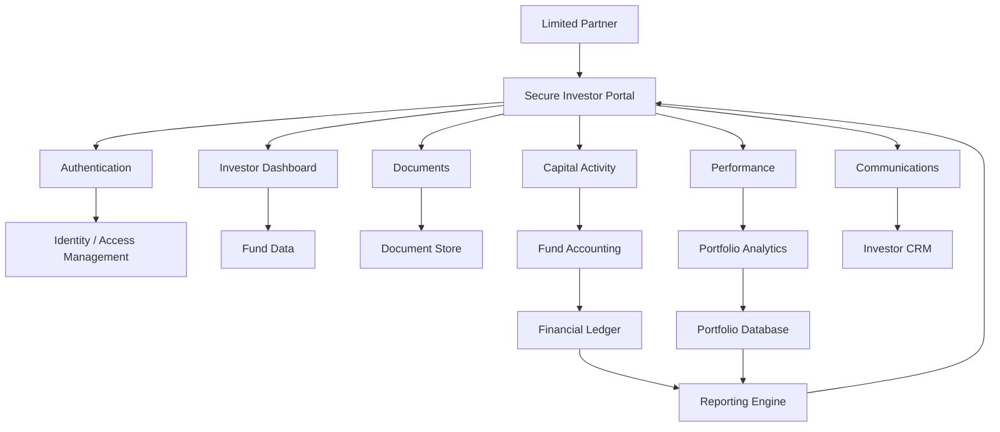
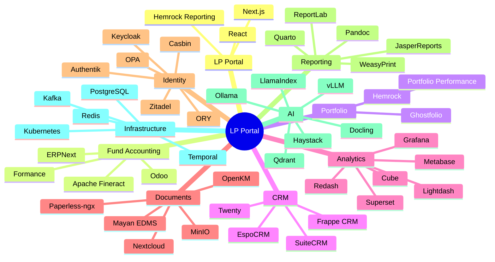

# Awesome-Limited-Partner-Portal

## 🏦 Top Limited Partner (LP) Portals & Open-Source Investor Relations Infrastructure

> A curated list of **Limited Partner (LP) portals, investor reporting platforms, private-markets investor relations software, fund-management platforms and open-source software** for building modern LP experiences.

LP portals sit at the intersection of:

* Investor relations
* Fund administration
* Fund accounting
* Capital calls
* Distributions
* Investor reporting
* Portfolio performance
* Data rooms
* Document management
* KYC / AML
* Fundraising
* Investor communications
* Portfolio analytics

Modern LP portals allow investors to securely access their fund information, documents, performance data, capital activity and communications from a centralized interface. For example, Juniper Square describes its portal as a unified environment for LPs to access investment data, documents, performance information and investor communications.

This repository focuses primarily on **open-source and self-hostable alternatives**, while maintaining a separate list of commercial platforms such as Juniper Square, Allvue, Dynamo Software, InvestorFlow, Fundwave, Carta, Visible, eFront, Backstop and SEI Archway.

> **Important:** Unlike generic SaaS dashboards, an institutional LP portal depends heavily on fund accounting, investor-level permissions, capital-account data, document security, audit trails and integrations with fund administrators. Consequently, a complete open-source alternative is usually a **composable stack** rather than a single application.

---

## 📑 Table of Contents

* [☁️ SaaS/Hosted Platforms](#️-saashosted-platforms)
* [🌍 Open-Source](#-open-source)
* [🏦 Open-Source LP Portal Platforms](#-open-source-lp-portal-platforms)
* [📊 Open-Source Fund & Portfolio Management](#-open-source-fund--portfolio-management)
* [💰 Open-Source Fund Accounting & Ledger](#-open-source-fund-accounting--ledger)
* [📈 Open-Source Portfolio Reporting](#-open-source-portfolio-reporting)
* [💼 Open-Source Investor CRM](#-open-source-investor-crm)
* [📁 Open-Source Data Rooms & Document Management](#-open-source-data-rooms--document-management)
* [🔐 Open-Source Identity & Access Management](#-open-source-identity--access-management)
* [📊 Open-Source Business Intelligence](#-open-source-business-intelligence)
* [📑 Open-Source Document & Reporting Infrastructure](#-open-source-document--reporting-infrastructure)
* [🤖 Open-Source AI for LP Reporting](#-open-source-ai-for-lp-reporting)
* [🧩 Commercial Platform → Open-Source Equivalent](#-commercial-platform--open-source-equivalent)
* [🏗️ LP Portal Architecture](#️-lp-portal-architecture)
* [🔄 Open-Source LP Portal Architecture](#-open-source-lp-portal-architecture)
* [📊 Investor Reporting Architecture](#-investor-reporting-architecture)
* [🔐 LP Data Security Architecture](#-lp-data-security-architecture)
* [⚖️ Commercial vs Open-Source](#️-commercial-vs-open-source)
* [🚀 Recommended Open-Source Stacks](#-recommended-open-source-stacks)
* [📊 LP Portal Technology Comparison](#-lp-portal-technology-comparison)
* [🎯 Recommended Projects by Use Case](#-recommended-projects-by-use-case)
* [🏢 Building a Juniper Square Alternative](#-building-a-juniper-square-alternative)
* [🏦 Building an Open-Source LP Portal](#-building-an-open-source-lp-portal)
* [🌐 Open-Source LP Technology Landscape](#-open-source-lp-technology-landscape)
* [🧠 Why Open-Source LP Infrastructure Matters](#-why-open-source-lp-infrastructure-matters)
* [🤝 Contributing](#-contributing)
* [⚠️ Disclaimer](#️-disclaimer)

---

# ☁️ SaaS/Hosted Platforms

Commercial LP portal platforms combine investor-facing portals with some combination of fund accounting, investor relations, reporting, portfolio monitoring, CRM, document management and fund administration.

| Platform                                                                                                            | Company            | Primary Focus                          | Key Capabilities                                                                |
| ------------------------------------------------------------------------------------------------------------------- | ------------------ | -------------------------------------- | ------------------------------------------------------------------------------- |
| [Juniper Square](https://www.junipersquare.com/)                                                                    | Juniper Square     | Private-markets operating platform     | LP portal, investor reporting, onboarding, fundraising, CRM, data rooms         |
| [Allvue](https://www.allvuesystems.com/)                                                                            | Allvue Systems     | Alternative investment management      | Investor portal, fund accounting, portfolio management, reporting               |
| [Dynamo Software](https://www.dynamosoftware.com/)                                                                  | Dynamo Software    | Alternative investment management      | Investor relations, CRM, portfolio management, reporting                        |
| [InvestorFlow](https://www.investorflow.com/)                                                                       | InvestorFlow       | Private-markets CRM & investor portal  | Fundraising, LP relations, CRM, investor engagement, analytics                  |
| [Fundwave](https://www.fundwave.com/)                                                                               | Fundwave           | Fund management                        | Fund accounting, investor management, reporting                                 |
| [Carta](https://carta.com/)                                                                                         | Carta              | Fund administration & private markets  | Fund administration, LP reporting, capital activity, K-1s, portfolio management |
| [Visible](https://visible.vc/)                                                                                      | Visible            | Portfolio reporting                    | Investor updates, portfolio monitoring, reporting and fundraising               |
| [eFront](https://www.blackrock.com/aladdin/en-us/solutions/eFront)                                                  | BlackRock / eFront | Alternative investment management      | Portfolio management, analytics, investor reporting                             |
| [Backstop Solutions](https://www.backstopsolutions.com/)                                                            | Backstop Solutions | Alternative investment management      | CRM, investor relations, research, portfolio analytics                          |
| [SEI Archway](https://www.seic.com/)                                                                                | SEI                | Investment accounting & administration | Private-markets accounting, reporting, investor services                        |
| [Juniper Square Portal](https://www.junipersquare.com/platform/portal)                                              | Juniper Square     | LP experience                          | Secure documents, investment information, performance and communication         |
| [FIS Digital Data Exchange](https://www.fisglobal.com/products/fis-private-capital-suite/fis-digital-data-exchange) | FIS                | Investor portal                        | Reporting, data visualization, secure documents, e-signing                      |
| [Apex Group](https://www.apexgroup.com/)                                                                            | Apex Group         | Fund administration                    | Investor portal, fund administration, reporting                                 |
| [FundCount](https://www.fundcount.com/)                                                                             | FundCount          | Fund accounting                        | Accounting, portfolio management, reporting                                     |
| [Altvia](https://www.altvia.com/)                                                                                   | Altvia             | Private-capital CRM                    | CRM, investor relations, fundraising and reporting                              |
| [Cobalt](https://www.cobalt-lp.com/)                                                                                | Cobalt             | LP reporting                           | Portfolio monitoring, reporting and investor communications                     |
| [Seraf](https://www.seraf.io/)                                                                                      | Seraf              | VC investor management                 | LP portal, documents, capital calls, distributions and reporting                |

Commercial LP platforms increasingly combine portal functionality with broader fund operating systems. Juniper Square, for example, connects investor onboarding, reporting, portal functionality, CRM and fund operations, while Allvue provides investor dashboards, secure document sharing, automated reporting and investor communication.

Carta similarly combines fund administration with LP access to investment performance, capital calls, distributions, tax documents and related fund information.

---

# 🌍 Open-Source

The open-source LP portal ecosystem is much smaller than the commercial ecosystem.

However, a substantial portion of the underlying technology can be assembled from open-source projects:

```text
                    OPEN-SOURCE LP PORTAL
                            │
       ┌────────────────────┼────────────────────┐
       │                    │                    │
       ▼                    ▼                    ▼
 Investor Portal        Fund Data            Reporting
       │                    │                    │
       ▼                    ▼                    ▼
 Next.js / React       Fineract / Ledger     Metabase
 Supabase              Formance              Apache Superset
 Keycloak              PostgreSQL            Grafana
       │                    │                    │
       └────────────────────┼────────────────────┘
                            │
                            ▼
                     Document Storage
                            │
                            ▼
                       MinIO / S3
```

The most directly relevant open-source project identified in this landscape is **Hemrock Reporting**, an Apache-2.0-licensed platform that explicitly includes LP reporting, fund accounting, portfolio monitoring and a fund-branded LP portal.

---

# 🏦 Open-Source LP Portal Platforms

## ⭐ Hemrock Reporting

[Hemrock Reporting](https://github.com/tdavidson/reporting) is an open-source venture-capital reporting and fund-management platform that includes:

* LP portal
* LP capital tracking
* Fund accounting
* Portfolio KPI collection
* Portfolio dashboards
* Investor reporting
* Fund performance reporting
* Fund and SPV accounting
* Capital-account statements
* Investor documents
* Quarterly reporting
* AI-assisted investor analysis
* Deal screening
* Due diligence

The project is released under **Apache-2.0** and is designed to be self-hosted. Its LP portal provides fund-branded access to capital-account statements, quarterly letters and fund documents.

```text
                     Hemrock Reporting

        Portfolio Data ────────┐
                               │
        Fund Accounting ───────┤
                               │
        LP Capital ────────────┤
                               ▼
                         Reporting Engine
                               │
                               ▼
                          LP Portal
                               │
                  ┌────────────┼────────────┐
                  ▼            ▼            ▼
              Statements   Fund Docs    Letters
```

---

# 📊 Open-Source Fund & Portfolio Management

| Project                                                      | Primary Role                                       |
| ------------------------------------------------------------ | -------------------------------------------------- |
| [Hemrock Reporting](https://github.com/tdavidson/reporting)  | VC reporting, LP portal, fund accounting           |
| [Apache Fineract](https://github.com/apache/fineract)        | Financial accounts and lending infrastructure      |
| [Mifos X](https://github.com/openMF/mifos-x)                 | Core financial management                          |
| [Formance](https://github.com/formancehq/stack)              | Financial ledger and money flows                   |
| [ERPNext](https://github.com/frappe/erpnext)                 | Accounting and business management                 |
| [Odoo Community](https://github.com/odoo/odoo)               | Accounting / ERP                                   |
| [Portfolio Performance](https://github.com/buchen/portfolio) | Investment portfolio tracking                      |
| [Ghostfolio](https://github.com/ghostfolio/ghostfolio)       | Open-source wealth / portfolio analytics           |
| [Maybe](https://github.com/maybe-finance/maybe)              | Open-source personal finance / investment platform |
| [Quadra](https://www.quadraplatform.com/)                    | Open investment-management data model              |

> **License note:** Quadra is currently described as source-available under Business Source License 1.1 rather than conventional permissive open source. It is therefore listed separately from fully open-source projects.

---

# 💰 Open-Source Fund Accounting & Ledger

A serious LP portal requires a reliable source of financial truth.

```text
                       FUND EVENTS
                            │
             ┌──────────────┼──────────────┐
             ▼              ▼              ▼
        Capital Call    Investment     Distribution
             │              │              │
             └──────────────┼──────────────┘
                            ▼
                       FUND LEDGER
                            │
                            ▼
                    LP CAPITAL ACCOUNTS
                            │
                            ▼
                     LP REPORTING
```

| Project                                                     | Description                                      |
| ----------------------------------------------------------- | ------------------------------------------------ |
| [Formance Ledger](https://github.com/formancehq/ledger)     | Programmable financial ledger                    |
| [Apache Fineract](https://github.com/apache/fineract)       | Financial accounting and accounts                |
| [Hemrock Reporting](https://github.com/tdavidson/reporting) | Fund accounting and LP capital tracking          |
| [ERPNext](https://github.com/frappe/erpnext)                | Accounting and financial management              |
| [Odoo Community](https://github.com/odoo/odoo)              | Accounting / ERP                                 |
| [Kill Bill](https://github.com/killbill/killbill)           | Billing and financial transaction infrastructure |

Hemrock's accounting module can maintain double-entry books for funds, SPVs and related entities and derive LP capital accounts and statements from the ledger.

---

# 📈 Open-Source Portfolio Reporting

| Project                                                      | Focus                           |
| ------------------------------------------------------------ | ------------------------------- |
| [Hemrock Reporting](https://github.com/tdavidson/reporting)  | Fund and portfolio reporting    |
| [Metabase](https://github.com/metabase/metabase)             | Business intelligence           |
| [Apache Superset](https://github.com/apache/superset)        | BI / analytics                  |
| [Grafana](https://github.com/grafana/grafana)                | Dashboards and monitoring       |
| [Redash](https://github.com/getredash/redash)                | SQL analytics                   |
| [Evidence](https://github.com/evidence-dev/evidence)         | Code-based data reporting       |
| [Lightdash](https://github.com/lightdash/lightdash)          | Semantic-layer BI               |
| [Cube](https://github.com/cube-js/cube)                      | Analytics infrastructure        |
| [Portfolio Performance](https://github.com/buchen/portfolio) | Investment performance analysis |

Typical LP metrics include:

```text
Committed Capital
Called Capital
Paid-In Capital
Unfunded Commitment
Distributions
NAV
TVPI
DPI
RVPI
IRR
MOIC
Investment Cost
Fair Value
Exposure
Portfolio Performance
```

---

# 💼 Open-Source Investor CRM

An LP portal is often only one component of investor-relations infrastructure.

```text
Investor CRM
     │
     ├── LP Profiles
     ├── Relationships
     ├── Commitments
     ├── Fund Interests
     ├── Communications
     ├── Fundraising
     ├── Meetings
     └── Documents
```

Useful open-source CRM platforms include:

| Project                                                     | Description                     |
| ----------------------------------------------------------- | ------------------------------- |
| [Twenty](https://github.com/twentyhq/twenty)                | Modern open-source CRM          |
| [EspoCRM](https://github.com/espocrm/espocrm)               | Open-source CRM                 |
| [SuiteCRM](https://github.com/salesagility/SuiteCRM)        | Enterprise CRM                  |
| [Odoo Community](https://github.com/odoo/odoo)              | CRM + ERP                       |
| [ERPNext](https://github.com/frappe/erpnext)                | CRM + ERP                       |
| [Frappe CRM](https://github.com/frappe/crm)                 | Open-source CRM                 |
| [Hemrock Reporting](https://github.com/tdavidson/reporting) | Fund-manager CRM / LP workflows |

---

# 📁 Open-Source Data Rooms & Document Management

LP portals need secure document delivery for:

* Quarterly reports
* Capital-account statements
* K-1s
* Financial statements
* Capital-call notices
* Distribution notices
* Subscription documents
* Side letters
* Fund agreements
* Tax documents
* Investor communications

Useful open-source building blocks:

| Project                                                         | Role                             |
| --------------------------------------------------------------- | -------------------------------- |
| [Paperless-ngx](https://github.com/paperless-ngx/paperless-ngx) | Document management              |
| [Nextcloud](https://github.com/nextcloud/server)                | File collaboration               |
| [OpenKM](https://github.com/openkm/document-management-system)  | Document management              |
| [Mayan EDMS](https://github.com/mayan-edms/Mayan-EDMS)          | Enterprise document management   |
| [MinIO](https://github.com/minio/minio)                         | Object storage                   |
| [Seafile](https://github.com/haiwen/seafile)                    | File sync and sharing            |
| [Immich](https://github.com/immich-app/immich)                  | Asset management                 |
| [Documenso](https://github.com/documenso/documenso)             | Open-source e-signatures         |
| [OpenSign](https://github.com/opensignlabs/opensign)            | Open-source e-signature platform |

A practical LP portal can use object storage such as MinIO together with a document-management layer and application-level authorization.

---

# 🔐 Open-Source Identity & Access Management

LP portals require strong investor-level authorization.

The fundamental security model is:

```text
                     LP LOGIN
                        │
                        ▼
                    Identity
                        │
                        ▼
                 Authentication
                        │
                        ▼
                  Authorization
                        │
              ┌─────────┴─────────┐
              ▼                   ▼
           Fund A              Fund B
              │                   │
              ▼                   ▼
           Investor 1          Investor 1
```

Useful projects:

| Project                                                       | Role                           |
| ------------------------------------------------------------- | ------------------------------ |
| [Keycloak](https://github.com/keycloak/keycloak)              | Identity and access management |
| [Authentik](https://github.com/goauthentik/authentik)         | Identity provider              |
| [Zitadel](https://github.com/zitadel/zitadel)                 | Identity management            |
| [ORY Kratos](https://github.com/ory/kratos)                   | Identity management            |
| [ORY Hydra](https://github.com/ory/hydra)                     | OAuth2 / OpenID Connect        |
| [Open Policy Agent](https://github.com/open-policy-agent/opa) | Policy engine                  |
| [Casbin](https://github.com/casbin/casbin)                    | Authorization framework        |

For LP portals, **row-level and object-level authorization** is especially important:

```text
LP A
 │
 ├── Fund I      ✅
 ├── Fund II     ❌
 ├── Fund III    ✅
 └── Fund IV     ❌
```

---

# 📊 Open-Source Business Intelligence

A modern LP portal can expose interactive dashboards instead of relying exclusively on PDFs.

| Project                                               | Strength                       |
| ----------------------------------------------------- | ------------------------------ |
| [Metabase](https://github.com/metabase/metabase)      | Easy analytics                 |
| [Apache Superset](https://github.com/apache/superset) | Enterprise BI                  |
| [Grafana](https://github.com/grafana/grafana)         | Dashboards                     |
| [Redash](https://github.com/getredash/redash)         | SQL analytics                  |
| [Lightdash](https://github.com/lightdash/lightdash)   | Semantic BI                    |
| [Evidence](https://github.com/evidence-dev/evidence)  | Developer-oriented reporting   |
| [Cube](https://github.com/cube-js/cube)               | Analytics API / semantic layer |

Example:

```text
                   FUND DATABASE
                         │
                         ▼
                   Data Warehouse
                         │
                         ▼
                 Semantic / Metrics Layer
                         │
              ┌──────────┼──────────┐
              ▼          ▼          ▼
          Metabase    Superset    Grafana
              │          │          │
              └──────────┼──────────┘
                         ▼
                      LP Portal
```

---

# 📑 Open-Source Document & Reporting Infrastructure

| Technology                                                      | Role                       |
| --------------------------------------------------------------- | -------------------------- |
| [WeasyPrint](https://github.com/Kozea/WeasyPrint)               | HTML → PDF                 |
| [Pandoc](https://github.com/jgm/pandoc)                         | Document conversion        |
| [LibreOffice](https://github.com/LibreOffice/core)              | Office document generation |
| [Quarto](https://github.com/quarto-dev/quarto-cli)              | Reproducible reports       |
| [JasperReports](https://github.com/TIBCOSoftware/jasperreports) | Enterprise reporting       |
| [ReportLab](https://github.com/ActiveState/reportlab)           | PDF generation             |
| [Docling](https://github.com/docling-project/docling)           | Document parsing           |
| [Gotenberg](https://github.com/gotenberg/gotenberg)             | Document conversion        |

A fund reporting system can generate:

```text
Fund Data
   │
   ▼
Reporting Templates
   │
   ├── Quarterly Report
   ├── Capital Account Statement
   ├── Capital Call Notice
   ├── Distribution Notice
   └── Investor Letter
   │
   ▼
PDF / HTML
   │
   ▼
Secure LP Portal
```

---

# 🤖 Open-Source AI for LP Reporting

AI can automate several LP reporting workflows:

```text
Fund Documents
      │
      ▼
Document Parsing
      │
      ▼
Data Extraction
      │
      ▼
Validation
      │
      ▼
Fund Database
      │
      ▼
AI Reporting
      │
      ├── Investor Letter
      ├── Quarterly Summary
      ├── Portfolio Commentary
      ├── LP Q&A
      └── Data Analysis
```

Useful open-source components:

| Project                                                         | Role                        |
| --------------------------------------------------------------- | --------------------------- |
| [Docling](https://github.com/docling-project/docling)           | Document parsing            |
| [Unstructured](https://github.com/Unstructured-IO/unstructured) | Document processing         |
| [OCRmyPDF](https://github.com/ocrmypdf/OCRmyPDF)                | OCR                         |
| [Tesseract](https://github.com/tesseract-ocr/tesseract)         | OCR                         |
| [LlamaIndex](https://github.com/run-llama/llama_index)          | RAG / data orchestration    |
| [Haystack](https://github.com/deepset-ai/haystack)              | AI orchestration            |
| [vLLM](https://github.com/vllm-project/vllm)                    | LLM inference               |
| [Ollama](https://github.com/ollama/ollama)                      | Local LLM runtime           |
| [Qdrant](https://github.com/qdrant/qdrant)                      | Vector database             |
| [pgvector](https://github.com/pgvector/pgvector)                | Vector search in PostgreSQL |

---

# 🧩 Commercial Platform → Open-Source Equivalent

| Commercial Platform    | Open-Source Equivalent / Building Blocks                      |
| ---------------------- | ------------------------------------------------------------- |
| **Juniper Square**     | Hemrock Reporting + Fineract/Formance + Keycloak + MinIO      |
| **Allvue**             | Fineract + Formance + Metabase/Superset + Keycloak            |
| **Dynamo Software**    | Twenty/Frappe CRM + Formance + Superset + document management |
| **InvestorFlow**       | Twenty + Frappe CRM + Hemrock + Metabase                      |
| **Fundwave**           | Fineract + Formance + Hemrock Reporting                       |
| **Carta**              | Hemrock + Formance + Fineract + CRM + document management     |
| **Visible.vc**         | Hemrock Reporting + Metabase + Superset                       |
| **eFront**             | Formance + Fineract + Apache Superset + PostgreSQL            |
| **Backstop Solutions** | Twenty / EspoCRM + Superset + Formance                        |
| **SEI Archway**        | Fineract + Formance + ERPNext + reporting stack               |
| **LP Portal**          | Hemrock Reporting + Next.js + Keycloak + MinIO                |
| **Investor Reporting** | Hemrock + Metabase / Superset                                 |
| **Investor CRM**       | Twenty / EspoCRM / Frappe CRM                                 |
| **Fund Accounting**    | Formance + Fineract + ERPNext                                 |
| **Data Room**          | Nextcloud + MinIO + Paperless-ngx                             |
| **LP Authentication**  | Keycloak / Authentik / Zitadel                                |
| **AI LP Analyst**      | LlamaIndex + Qdrant + vLLM / Ollama                           |

---

# 🏗️ LP Portal Architecture

A typical institutional LP portal looks like:



---

# 🔄 Open-Source LP Portal Architecture

```text id="l2wz1p"
                         LIMITED PARTNER
                                │
                                ▼
                         ┌─────────────┐
                         │ LP PORTAL   │
                         │ Next.js     │
                         └──────┬──────┘
                                │
                         ┌──────▼──────┐
                         │  Keycloak   │
                         │ Auth / RBAC  │
                         └──────┬──────┘
                                │
          ┌─────────────────────┼──────────────────────┐
          │                     │                      │
          ▼                     ▼                      ▼
      Dashboard             Documents             Reporting
          │                     │                      │
          ▼                     ▼                      ▼
      PostgreSQL              MinIO             Metabase/Superset
          │                     │                      │
          └─────────────────────┼──────────────────────┘
                                ▼
                         Fund Data Layer
                                │
                  ┌─────────────┼─────────────┐
                  ▼             ▼             ▼
              Fineract       Formance      Hemrock
                  │             │             │
                  └─────────────┼─────────────┘
                                ▼
                         Reconciliation
```

---

# 📊 Investor Reporting Architecture

```text id="2r1hkt"
                   FUND ADMIN / ACCOUNTING
                            │
                            ▼
                      Source Data
                            │
                            ▼
                  Data Normalization
                            │
                            ▼
                     Fund Database
                            │
          ┌─────────────────┼─────────────────┐
          │                 │                 │
          ▼                 ▼                 ▼
      Capital Calls     Distributions       NAV
          │                 │                 │
          └─────────────────┼─────────────────┘
                            ▼
                    Investor Calculations
                            │
                 ┌──────────┼──────────┐
                 ▼          ▼          ▼
               IRR        TVPI        DPI
                 │          │          │
                 └──────────┼──────────┘
                            ▼
                    Reporting Engine
                            │
                 ┌──────────┼──────────┐
                 ▼          ▼          ▼
               PDF        HTML       API
                 │          │          │
                 └──────────┼──────────┘
                            ▼
                        LP PORTAL
```

---

# 🔐 LP Data Security Architecture

LP portals contain extremely sensitive financial information.

A secure architecture should enforce authorization at multiple layers:

```text
                         LP USER
                            │
                            ▼
                     Authentication
                            │
                            ▼
                       MFA / SSO
                            │
                            ▼
                     Authorization
                            │
                            ▼
                     Organization
                            │
                            ▼
                        Investor
                            │
                            ▼
                         Fund
                            │
                            ▼
                       Document
                            │
                            ▼
                      Audit Logging
```

Example access model:

```text
Investor: alice@example.com

Fund I
 ├── Capital Account       ✅
 ├── Quarterly Report      ✅
 ├── K-1                   ✅
 └── Side Letter           ✅

Fund II
 ├── Capital Account       ❌
 ├── Quarterly Report      ❌
 └── K-1                   ❌

Fund III
 ├── Capital Account       ✅
 └── Quarterly Report      ✅
```

Recommended infrastructure:

```text
Keycloak
+
PostgreSQL Row-Level Security
+
Object-Level Authorization
+
MinIO / S3
+
Signed URLs
+
Audit Logs
+
Encryption
+
MFA
```

---

# 📬 LP Communication Architecture

```text
                      FUND MANAGER
                           │
                           ▼
                   Investor CRM
                           │
             ┌─────────────┼─────────────┐
             ▼             ▼             ▼
         Announcements   Reports      Documents
             │             │             │
             └─────────────┼─────────────┘
                           ▼
                     Notification
                           │
                  ┌────────┼────────┐
                  ▼        ▼        ▼
                Email     Portal   API
```

Useful open-source infrastructure:

* [Listmonk](https://github.com/knadh/listmonk)
* [Novu](https://github.com/novuhq/novu)
* [Postal](https://github.com/postalserver/postal)
* [Mautic](https://github.com/mautic/mautic)

---

# 📑 LP Document Delivery

A production system can separate **document storage** from **document authorization**:

```text
                    LP
                    │
                    ▼
               Authorization
                    │
                    ▼
              Document Service
                    │
                    ▼
                 MinIO
                    │
                    ▼
              Signed Download
                    │
                    ▼
                  PDF
```

This prevents a direct object-storage URL from becoming the source of authorization truth.

---

# 📈 LP Performance Dashboard

A modern LP dashboard can expose:

```text
┌────────────────────────────────────────────┐
│                FUND III                    │
├────────────────────────────────────────────┤
│ Commitment       $10.0M                    │
│ Called           $7.5M                     │
│ Unfunded         $2.5M                     │
│ NAV              $11.8M                    │
│ Distributions    $4.2M                     │
│ TVPI             2.13x                     │
│ DPI              0.56x                     │
│ IRR              18.4%                     │
└────────────────────────────────────────────┘
```

Additional views:

```text
Fund Performance
Portfolio Exposure
Investment History
Capital Activity
Cash Flows
Distributions
Unfunded Commitment
Documents
Tax Documents
Quarterly Reports
Investor Communications
```

---

# ⚖️ Commercial vs Open-Source

| Capability                    | Commercial LP Platform | Open-Source Stack   |
| ----------------------------- | ---------------------- | ------------------- |
| LP Portal                     | ✅                      | ✅                   |
| Investor Dashboard            | ✅                      | ✅                   |
| Fund Reporting                | ✅                      | ✅                   |
| Documents                     | ✅                      | ✅                   |
| Capital Calls                 | ✅                      | Build / integrate   |
| Distributions                 | ✅                      | Build / integrate   |
| Fund Accounting               | ✅                      | ✅ Building blocks   |
| Investor CRM                  | ✅                      | ✅                   |
| Data Room                     | ✅                      | ✅                   |
| K-1 Delivery                  | ✅                      | Build / integrate   |
| Tax Workflows                 | ✅                      | Build / integrate   |
| Portfolio Analytics           | ✅                      | ✅                   |
| AI Reporting                  | Increasingly           | ✅ Build / integrate |
| SSO                           | ✅                      | ✅                   |
| MFA                           | ✅                      | ✅                   |
| RBAC                          | ✅                      | ✅                   |
| Row-Level Security            | ✅                      | ✅                   |
| Audit Logs                    | ✅                      | ✅                   |
| Self Hosting                  | Usually ❌              | ✅                   |
| Source Code                   | ❌                      | ✅                   |
| Data Ownership                | Vendor-dependent       | Full control        |
| Customization                 | Medium / High          | Very High           |
| Vendor Lock-In                | Higher                 | Lower               |
| Implementation                | Faster                 | More engineering    |
| Fund Administration           | Often integrated       | External            |
| Regulatory Operations         | Often supported        | Self-managed        |
| Banking / Custody Integration | Integrated             | Build / integrate   |
| Infrastructure                | Managed                | Self-managed        |

---

# 📊 LP Portal Technology Comparison

| Platform / Project | LP Portal | Fund Accounting | CRM | Reporting | Portfolio Analytics | Self-Host |
| ------------------ | :-------: | :-------------: | :-: | :-------: | :-----------------: | :-------: |
| Juniper Square     |     ✅     |        ✅        |  ✅  |     ✅     |          ✅          |     ❌     |
| Allvue             |     ✅     |        ✅        |  ✅  |     ✅     |          ✅          |     ❌     |
| Dynamo             |     ✅     |        ✅        |  ✅  |     ✅     |          ✅          |     ❌     |
| InvestorFlow       |     ✅     |        ⚠️       |  ✅  |     ✅     |          ✅          |     ❌     |
| Fundwave           |     ✅     |        ✅        |  ✅  |     ✅     |          ✅          |     ❌     |
| Carta              |     ✅     |        ✅        |  ✅  |     ✅     |          ✅          |     ❌     |
| Visible            |     ⚠️    |        ❌        |  ⚠️ |     ✅     |          ✅          |     ❌     |
| eFront             |     ✅     |        ✅        |  ✅  |     ✅     |          ✅          |     ❌     |
| Backstop           |     ✅     |        ⚠️       |  ✅  |     ✅     |          ✅          |     ❌     |
| SEI Archway        |     ✅     |        ✅        |  ⚠️ |     ✅     |          ✅          |     ❌     |
| Hemrock Reporting  |     ✅     |        ✅        |  ⚠️ |     ✅     |          ✅          |     ✅     |
| Apache Fineract    |     ❌     |        ✅        |  ⚠️ |     ⚠️    |          ❌          |     ✅     |
| Formance           |     ❌     |        ✅        |  ❌  |     ⚠️    |          ❌          |     ✅     |
| Metabase           |     ❌     |        ❌        |  ❌  |     ✅     |          ✅          |     ✅     |
| Superset           |     ❌     |        ❌        |  ❌  |     ✅     |          ✅          |     ✅     |
| Twenty             |     ❌     |        ❌        |  ✅  |     ⚠️    |          ❌          |     ✅     |
| Keycloak           |     ❌     |        ❌        |  ❌  |     ❌     |          ❌          |     ✅     |
| MinIO              |     ❌     |        ❌        |  ❌  |     ❌     |          ❌          |     ✅     |

---

# 🚀 Recommended Open-Source Stacks

## 🏆 1. Closest Open-Source LP Portal

```text
Hemrock Reporting
+
PostgreSQL
+
Keycloak
+
MinIO
```

This is the most direct starting point when the goal is specifically an open-source LP portal rather than assembling one entirely from components.

Hemrock explicitly combines portfolio monitoring, fund accounting, LP reporting and an LP portal in one open-source platform.

---

# 🏦 2. Institutional LP Portal

```text
Hemrock
+
Formance
+
PostgreSQL
+
Keycloak
+
MinIO
+
Apache Superset
+
Temporal
+
Kafka
```

Suitable for building a more modular institutional architecture.

---

# 💰 3. Fund Accounting + LP Portal

```text
Apache Fineract
        +
Formance
        +
Hemrock
        +
Keycloak
        +
MinIO
```

---

# 📊 4. LP Analytics Platform

```text
PostgreSQL
     +
dbt
     +
Cube
     +
Apache Superset
     +
Next.js
```

Useful when the primary requirement is:

* LP dashboards
* Fund performance
* Portfolio analytics
* Exposure analysis
* Custom reporting

---

# 🤝 5. Investor CRM + LP Portal

```text
Twenty / Frappe CRM
        +
Hemrock
        +
Keycloak
        +
MinIO
        +
Metabase
```

---

# 🤖 6. AI-Powered LP Portal

```text
                     LP
                      │
                      ▼
                 LP Portal
                      │
                      ▼
                AI Assistant
                      │
          ┌───────────┼───────────┐
          ▼           ▼           ▼
       Fund Data   Documents   Reports
          │           │           │
          ▼           ▼           ▼
      PostgreSQL    Qdrant      MinIO
          │           │
          └──────┬────┘
                 ▼
              LLM
         vLLM / Ollama
```

Possible components:

```text
Hemrock
+
LlamaIndex
+
Qdrant
+
vLLM
+
Docling
+
PostgreSQL
```

---

# 🏢 Building a Juniper Square Alternative

A Juniper Square-style architecture can be decomposed into:

```text
                         GP / FUND MANAGER
                                │
                                ▼
                         Operating Platform
                                │
         ┌──────────────────────┼──────────────────────┐
         │                      │                      │
         ▼                      ▼                      ▼
     Fundraising             Accounting             Investors
         │                      │                      │
         ▼                      ▼                      ▼
       CRM                   Ledger                 LP Portal
                                │                      │
                                ▼                      ▼
                          Fund Reporting           Documents
                                │                      │
                                └──────────┬───────────┘
                                           ▼
                                     LP Analytics
```

Possible open-source implementation:

```text
CRM
→ Twenty / Frappe CRM

Fund Accounting
→ Formance / Fineract

LP Reporting
→ Hemrock

Analytics
→ Superset / Metabase

Documents
→ MinIO / Nextcloud

Identity
→ Keycloak

Workflow
→ Temporal

Database
→ PostgreSQL

AI
→ LlamaIndex + vLLM
```

---

# 🏦 Building an Open-Source LP Portal

A minimal architecture:

```text
                   LP
                    │
                    ▼
             ┌─────────────┐
             │  Next.js    │
             │  LP Portal  │
             └──────┬──────┘
                    │
             ┌──────▼──────┐
             │  Keycloak   │
             └──────┬──────┘
                    │
             ┌──────▼──────┐
             │  FastAPI    │
             └──────┬──────┘
                    │
       ┌────────────┼────────────┐
       ▼            ▼            ▼
   PostgreSQL      MinIO      Reporting
       │                         │
       ▼                         ▼
   Fund Data                 Superset
```

---

# 🧱 LP Portal Data Model

A useful relational model:

```text
Investor
   │
   ├── Investor Users
   │
   ├── Commitments
   │
   ├── Capital Accounts
   │
   └── Documents
          │
          ▼
        Fund
          │
          ├── Investments
          ├── Capital Calls
          ├── Distributions
          ├── NAV
          └── Reports
```

Example:

```text
Investor
 ├── Alice Capital
 │
 ├── Fund I
 │    ├── Commitment
 │    ├── Capital Calls
 │    ├── Distributions
 │    ├── NAV
 │    └── Documents
 │
 └── Fund II
      ├── Commitment
      ├── Capital Calls
      ├── Distributions
      └── Documents
```

---

# 🌐 Open-Source LP Technology Landscape



---

# 🧠 Why Open-Source LP Infrastructure Matters

Commercial LP portals provide substantial value by combining:

```text
Fund Accounting
      +
Investor Relations
      +
Reporting
      +
Documents
      +
CRM
      +
Analytics
      +
Security
```

The open-source opportunity is different.

Rather than reproducing every commercial feature in one monolithic application, organizations can build a modular stack:

```text
                    OPEN-SOURCE
                         │
       ┌─────────────────┼─────────────────┐
       │                 │                 │
       ▼                 ▼                 ▼
      Data             Logic            Experience
       │                 │                 │
       ▼                 ▼                 ▼
 PostgreSQL          Formance           Next.js
 Fineract            Hemrock            React
 MinIO               Temporal            Metabase
                     Fineract            Keycloak
```

This provides control over:

* Data ownership
* Deployment
* Security architecture
* User experience
* Investor-level permissions
* Reporting logic
* AI models
* Integrations
* Infrastructure
* Vendor dependencies

The most compelling open-source approach is therefore not necessarily a single "Juniper Square clone", but a **composable private-markets operating system**.

---

# 🔥 Open-Source LP Portal Reference Stack

```text
┌──────────────────────────────────────────────┐
│                  LP PORTAL                   │
│             Next.js / React                  │
└──────────────────────┬───────────────────────┘
                       │
┌──────────────────────▼───────────────────────┐
│              IDENTITY & SECURITY             │
│       Keycloak + OPA + PostgreSQL RLS        │
└──────────────────────┬───────────────────────┘
                       │
┌──────────────────────▼───────────────────────┐
│                 API LAYER                    │
│             FastAPI / GraphQL                │
└──────────────────────┬───────────────────────┘
                       │
       ┌───────────────┼────────────────┐
       │               │                │
       ▼               ▼                ▼
   FUND DATA        REPORTING       DOCUMENTS
       │               │                │
       ▼               ▼                ▼
  Fineract          Hemrock           MinIO
  Formance          Superset          Nextcloud
       │               │                │
       └───────────────┼────────────────┘
                       ▼
                PostgreSQL
                       │
             ┌─────────┴─────────┐
             ▼                   ▼
         Analytics               AI
             │                   │
             ▼                   ▼
        Metabase /          LlamaIndex /
        Superset            vLLM / Qdrant
```

---

# 🎯 Recommended Projects by Use Case

| Use Case                  | Recommended Starting Point                           |
| ------------------------- | ---------------------------------------------------- |
| Open-source LP portal     | **Hemrock Reporting**                                |
| Fund accounting           | **Formance / Fineract**                              |
| LP capital tracking       | **Hemrock Reporting**                                |
| Portfolio reporting       | **Hemrock + Superset**                               |
| Investor CRM              | **Twenty / Frappe CRM**                              |
| Data room                 | **Nextcloud / MinIO**                                |
| Document management       | **Paperless-ngx / Mayan EDMS**                       |
| Authentication            | **Keycloak**                                         |
| Authorization             | **OPA / Casbin**                                     |
| BI                        | **Metabase / Apache Superset**                       |
| Fund analytics            | **Cube + Superset**                                  |
| PDF reports               | **WeasyPrint / JasperReports**                       |
| E-signatures              | **Documenso / OpenSign**                             |
| AI document processing    | **Docling**                                          |
| AI investor assistant     | **LlamaIndex + Qdrant + vLLM**                       |
| Workflow automation       | **Temporal**                                         |
| Event infrastructure      | **Kafka / NATS**                                     |
| Object storage            | **MinIO**                                            |
| Database                  | **PostgreSQL**                                       |
| Complete modular LP stack | **Hemrock + Formance + Keycloak + MinIO + Superset** |

---

# 🧩 Commercial LP Portal → OSS Architecture Mapping

```text
Juniper Square
      │
      ├── LP Portal          → Hemrock / Next.js
      ├── Fund Data          → PostgreSQL / Fineract
      ├── Fund Accounting    → Formance / Fineract
      ├── Investor CRM       → Twenty
      ├── Documents          → MinIO / Nextcloud
      ├── Analytics          → Superset
      └── AI                 → LlamaIndex + vLLM


Allvue
      │
      ├── Fund Accounting    → Fineract / Formance
      ├── Investor Portal    → Hemrock / Next.js
      ├── Portfolio          → PostgreSQL
      ├── Reporting          → Superset
      └── CRM                → Twenty


Dynamo
      │
      ├── Investor CRM       → Twenty / Frappe CRM
      ├── Portfolio          → PostgreSQL
      ├── Reporting          → Superset
      └── Documents          → Nextcloud / MinIO


Carta
      │
      ├── Fund Data          → Fineract / Formance
      ├── LP Reporting       → Hemrock
      ├── Documents          → MinIO
      ├── CRM                → Twenty
      └── Analytics          → Superset


Visible
      │
      ├── Portfolio Data     → PostgreSQL
      ├── Investor Updates   → Hemrock
      └── Analytics          → Metabase / Superset
```

---

# 🚀 Production Open-Source LP Platform

A more complete architecture:

```text
                         INTERNET
                            │
                            ▼
                       CDN / WAF
                            │
                            ▼
                       API Gateway
                            │
                            ▼
                     Authentication
                       Keycloak
                            │
                            ▼
                       LP Portal
                     Next.js / React
                            │
          ┌─────────────────┼─────────────────┐
          │                 │                 │
          ▼                 ▼                 ▼
       Investor          Reporting         Documents
       Services           Engine             Service
          │                 │                 │
          ▼                 ▼                 ▼
       PostgreSQL         Superset           MinIO
          │                 │                 │
          └─────────────────┼─────────────────┘
                            ▼
                     Fund Data Layer
                            │
             ┌──────────────┼──────────────┐
             ▼              ▼              ▼
          Fineract       Formance        Hemrock
             │              │              │
             └──────────────┼──────────────┘
                            ▼
                      Data Warehouse
                            │
                            ▼
                      AI / Analytics
```

---

# 🤝 Contributing

Contributions are welcome!

Please consider adding:

* Open-source LP portals
* Fund-management systems
* Investor reporting platforms
* Fund accounting systems
* Portfolio management software
* Investor CRMs
* Data rooms
* Document-management systems
* Open-source e-signature platforms
* Investor analytics tools
* Fund-performance analytics
* Capital-call systems
* Distribution systems
* K-1 delivery infrastructure
* Investor communication systems
* AI investor assistants
* Open-source private-markets infrastructure
* Self-hosted financial reporting systems

When adding a project, please clearly distinguish between:

* **Fully open-source**
* **Open-core**
* **Source available**
* **Business Source License**
* **Hosted open-source**
* **Commercial software using open-source components**

In particular, do not treat source-available software as equivalent to permissively licensed open-source software.

---

# ⚠️ Disclaimer

This repository is an independent technical curation and is **not affiliated with or endorsed by any company or project listed here**.

LP portals contain highly sensitive financial and personal information. Production deployments should carefully consider:

* Investor-level authorization
* Row-level security
* Document permissions
* Encryption
* MFA
* SSO
* Audit logging
* Data retention
* Backup and disaster recovery
* Data residency
* Regulatory requirements
* Fund-administration controls
* Tax reporting
* Financial statement controls
* SOC 2 / ISO 27001 requirements where applicable
* Privacy regulations
* Vendor and infrastructure security

Open-source software provides technology building blocks; it does not automatically provide regulatory compliance, fund administration, audit controls or investment-management services.

Commercial platforms also frequently combine software with operational services and integrations that are difficult to reproduce purely through software.

Licensing can change over time. Always verify the current license for both the project and its dependencies before commercial deployment.

---

## ⭐ Star This Repository

If you are interested in:

* Limited Partner Portals
* Investor Relations
* Private Equity Software
* Venture Capital Software
* Fund Management
* Fund Accounting
* Portfolio Reporting
* Private Markets
* Alternative Investments
* Investor Analytics
* Open-Source Finance
* Open-Source Fintech

consider giving this repository a ⭐ **Star** and contributing new projects.

---

**Last updated: September 2026**

