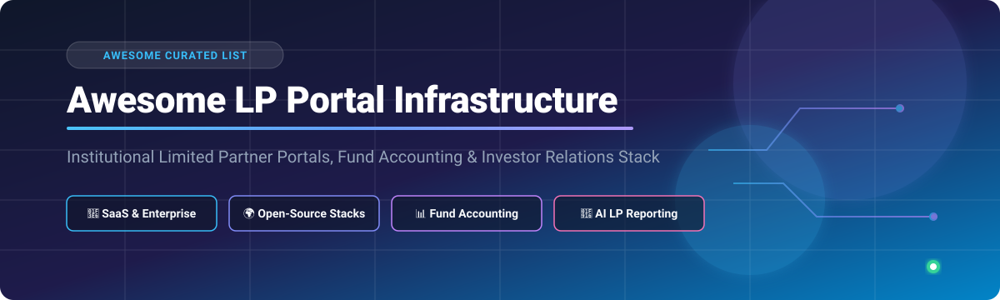
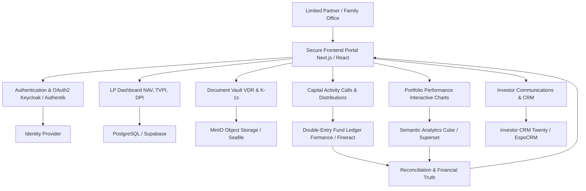

# 🏦 Awesome Limited Partner (LP) Portal Infrastructure

<p center>
  
</p>

## 💼 Top Limited Partner (LP) Portals, Private Equity Software & Open-Source Investor Relations Infrastructure

<a href="https://github.com/ishandutta2007/Awesome-Awesome-Awesome"></a><a href="https://discord.gg/jc4xtF58Ve"></a>
[](https://awesome.re)
[](https://opensource.org/licenses/MIT)
[](http://makeapullrequest.com)
<a href="https://github.com/ishandutta2007"></a>

> 🚀 A curated list of **Limited Partner (LP) portals, investor reporting platforms, private-markets investor relations software, venture capital fund-management platforms, private equity CRM, fund accounting software, and open-source fintech building blocks** for modern LP experiences.

Institutional LP portals sit at the operational intersection of:

* 🤝 **Investor Relations (IR)** & LP Engagement
* 🏦 **Fund Administration** & Transfer Agency
* 💰 **Fund Accounting** & General Ledger
* 📜 **Capital Calls** & Distribution Notices
* 📊 **Investor Reporting** & Performance Dashboards
* 📈 **Portfolio Performance & KPI Tracking** (IRR, TVPI, DPI, MOIC)
* 🔐 **Virtual Data Rooms (VDR)** & Document Security
* 📝 **KYC / AML Onboarding** & Investor Subscription Workflows
* 📑 **Tax Document Delivery** (Schedule K-1 / Tax Statements)

Modern LP portals allow institutional investors, family offices, and high-net-worth individuals to securely access their fund performance, capital-account statements, notices, and communications from a centralized, branded dashboard. For example, platforms like **Juniper Square** and **Carta** provide unified portals connecting fund operations directly with investor reporting.

This repository provides an exhaustive guide to **commercial SaaS platforms** and **open-source self-hostable alternatives**, detailing architectural patterns for building a modern LP portal stack.

> 💡 **Important Architecture Note:** Unlike generic B2B SaaS dashboards, an institutional LP portal requires granular row-level and object-level permissions, fund accounting ledgers, audit trails, and strict data security compliance. A complete open-source alternative is typically built as a **composable stack** combining identity management, financial ledgers, document storage, and reporting engines.

---

## 📑 Table of Contents

* [☁️ SaaS & Commercial LP Platforms](#️-saas--commercial-lp-platforms)
* [🌍 Open-Source Ecosystem](#-open-source-ecosystem)
* [🏦 Open-Source LP Portal Platforms](#-open-source-lp-portal-platforms)
* [📊 Open-Source Fund & Portfolio Management](#-open-source-fund--portfolio-management)
* [💰 Open-Source Fund Accounting & Ledger](#-open-source-fund-accounting--ledger)
* [📈 Open-Source Portfolio Reporting](#-open-source-portfolio-reporting)
* [💼 Open-Source Investor CRM](#-open-source-investor-crm)
* [📁 Open-Source Data Rooms & Document Management](#-open-source-data-rooms--document-management)
* [🔐 Open-Source Identity & Access Management](#-open-source-identity--access-management)
* [📊 Open-Source Business Intelligence & Analytics](#-open-source-business-intelligence--analytics)
* [📑 Open-Source Document & Reporting Infrastructure](#-open-source-document--reporting-infrastructure)
* [⚡ Open-Source Backend, Database & Workflow Infrastructure](#-open-source-backend-database--workflow-infrastructure)
* [🤖 Open-Source AI for LP Reporting](#-open-source-ai-for-lp-reporting)
* [🧩 Commercial Platform → Open-Source Equivalent](#-commercial-platform--open-source-equivalent)
* [🏗️ LP Portal Architecture](#️-lp-portal-architecture)
* [💖 Support & Sponsorship](#-support--sponsorship)
* [🤝 Contributing](#-contributing)
* [📈 Star History](#-star-history)
* [⚠️ Disclaimer](#️-disclaimer)

---

# ☁️ SaaS & Commercial LP Platforms

The private capital software market (including LP portals, fund accounting, and deal management) is estimated at **$2.4 Billion USD** (growing at **11.0% CAGR** toward **$5.1 Billion by 2032**). The market is **highly fragmented but rapidly consolidating**, moving away from disparate point solutions toward unified AI-native private equity operating systems.

Below is a detailed overview of commercial SaaS LP portals sorted by **company scale (Annual Revenue / Valuation)**:

| Platform | Company / Vendor | Primary Focus | Revenue / Valuation Scale (Desc) | Starting Price (Paid Tier) | Free Tier / Trial Limits | Key Capabilities |
| :--- | :--- | :--- | :--- | :--- | :--- | :--- |
| [BlackRock eFront](https://www.blackrock.com/aladdin/en-us/solutions/eFront) | BlackRock, Inc. (NYSE: BLK) | Alternative Investment Management | **$24.22 Billion Revenue** (Acquired for $1.3 Billion) | $50,000 / year starting enterprise contract | No Free Tier or Trial (Enterprise Demo Only) | Portfolio management, LP reporting, fund accounting, waterfall analytics |
| [SEI Archway](https://www.seic.com/) | SEI Investments Co. (NASDAQ: SEIC) | Family Office & Investment Accounting | **$2.30 Billion Revenue** ($8.5 Billion Valuation) | $30,000 / year base software licensing | No Free Tier or Trial (Custom Consultation Only) | Private equity accounting, tax reporting, LP portal, family office suite |
| [Apex Group](https://www.apexgroup.com/) | Apex Group Ltd. | Global Fund Administration & IR | **$1.50 Billion Revenue** (Private PE-backed) | $25,000 / year fund admin package | No Free Tier or Trial (Custom Proposal Only) | Investor portal, global fund administration, ESG reporting, compliance |
| [Juniper Square](https://www.junipersquare.com/) | Juniper Square, Inc. | Private Markets Operating Platform | **$1.10 Billion Valuation** ($139.8 Million Revenue) | $10,000 / year minimum platform fee | No Free Tier or Trial (Sales Demo Required) | LP portal, CRM, investor onboarding, capital calls, distributions, VDR |
| [Carta](https://carta.com/) | Carta, Inc. | Fund Admin & Private Equity Management | **$3.50 Billion Valuation** ($500 Million Revenue) | $2,900 / year starting tier (avg. $14,000/yr) | **Carta Launch Plan** (Free for startups with ≤25 stakeholders & <$1M raised; no trial limit) | Cap table management, LP portal, K-1 generation, portfolio monitoring |
| [Allvue Systems](https://www.allvuesystems.com/) | Allvue Systems | Alternative Investment Software | **$250 Million Revenue** (Private PE-backed) | $20,000 / year base platform fee | No Free Tier or Trial (Sales Demo Required) | LP portal, fund accounting, deal management, pipeline tracking |
| [FIS Digital Data Exchange](https://www.fisglobal.com/products/fis-private-capital-suite/fis-digital-data-exchange) | FIS (NYSE: FIS) | Capital Markets & Investor Portal | **$150 Million Revenue** (Division of $10B+ FIS) | $15,000 / year starting portal license | No Free Tier or Trial (Sales Demo Required) | Investor reporting, interactive visualization, electronic signing, VDR |
| [Dynamo Software](https://www.dynamosoftware.com/) | Dynamo Software | Private Equity CRM & IR | **$100 Million Revenue** (Private PE-backed) | $12,000 / year starting IR package | No Free Tier or Trial (Sales Demo Required) | LP CRM, investor relations, research management, portal |
| [InvestorFlow](https://www.investorflow.com/) | InvestorFlow | Private Markets CRM & Portal | **$50 Million Revenue** (Private PE-backed) | $10,000 / year starting license | No Free Tier or Trial (Sales Demo Required) | Investor engagement, LP portal, fundraising pipeline, analytics |
| [Backstop Solutions](https://www.backstopsolutions.com/) | Backstop Solutions | Investment Management Suite | **$45 Million Revenue** (Part of Ion Group) | $8,500 / year starting module | No Free Tier or Trial (Guided Demo Only) | CRM, LP relations, portfolio analytics, research management |
| [FundCount](https://www.fundcount.com/) | FundCount, LLC | Investment & Fund Accounting | **$25 Million Revenue** | $7,500 / year starting software fee | No Free Tier or Trial (30-day sandbox demo available on request) | Double-entry fund accounting, LP statement generation, portfolio tracking |
| [Altvia](https://www.altvia.com/) | Altvia Solutions | Private Equity CRM & LP Portal | **$20 Million Revenue** | $6,000 / year starting CRM package | No Free Tier or Trial (Sales Demo Required) | Salesforce-native PE CRM, LP portal, data room, investor communications |
| [Fundwave](https://www.fundwave.com/) | Fundwave | Modern Fund Management Software | **$12 Million Revenue** | $250 / month ($3,000/yr) starting tier | **14-day Free Trial** (Full access to fund accounting & portal features) | Fund accounting, LP capital calls, distribution notices, investor portal |
| [Visible.vc](https://visible.vc/) | Visible VC | Portfolio Monitoring & Investor Updates | **$7.20 Million Revenue** ($5.3M Funding) | $59 / month ($708/yr) Base tier | **Starter Plan Free Forever** (Send updates to 100 investors, 2 pitch decks; 14-day trial for paid features) | Portfolio KPI collection, LP updates, pitch decks, lightweight data room |
| [Cobalt](https://www.cobalt-lp.com/) | Cobalt Software (FactSet) | LP Portfolio Monitoring & Analysis | **$5.00 Million Revenue** (Acquired by FactSet) | $5,000 / year starting reporting module | No Free Tier or Trial (Sales Demo Required) | LP portfolio analytics, benchmarking, cash flow forecasting |
| [Seraf](https://www.seraf.io/) | Seraf Systems | Angel & VC Investor Management | **$3.00 Million Revenue** | $12 / month ($144/yr) Professional plan | **14-day Free Trial** (Full feature access; no credit card required) | LP portal, portfolio tracking, document vault, capital call tracking |

---

# 🌍 Open-Source Ecosystem

While commercial SaaS platforms provide out-of-the-box suites, open-source building blocks offer total control over sensitive LP financial data, customizable workflows, and zero platform lock-in.

```text
                    OPEN-SOURCE LP PORTAL ARCHITECTURE
                                    │
       ┌────────────────────────────┼────────────────────────────┐
       │                            │                            │
       ▼                            ▼                            ▼
 Investor Portal              Fund Ledger & Data              Reporting & Analytics
       │                            │                            │
       ▼                            ▼                            ▼
 Next.js / React               Fineract / Ledger             Metabase / Superset
 Supabase / Appwrite           Formance                      Grafana / Evidence
 Keycloak / Authentik          PostgreSQL                    Docling / WeasyPrint
       │                            │                            │
       └────────────────────────────┼────────────────────────────┘
                                    │
                                    ▼
                             Secure Document Vault
                                    │
                                    ▼
                         MinIO / Paperless-ngx / S3
```

---

# 🏦 Open-Source LP Portal Platforms

Fully dedicated open-source LP portal platforms tailored explicitly for private equity and venture capital funds:

| Project | Stars | Primary Role & Description |
| :--- | :--- | :--- |
| [Hemrock Reporting](https://github.com/tdavidson/reporting) | [](https://github.com/tdavidson/reporting/stargazers) | 🏢 **Venture Capital Reporting & LP Portal** — Apache-2.0 platform featuring LP capital tracking, double-entry fund accounting, portfolio KPI collection, quarterly reports, and fund-branded LP statements. |

---

# 📊 Open-Source Fund & Portfolio Management

Open-source core banking, financial management, wealth tracking, and portfolio software sorted by GitHub stars:

| Project | Stars | Primary Role & Description |
| :--- | :--- | :--- |
| [Maybe](https://github.com/maybe-finance/maybe) | [](https://github.com/maybe-finance/maybe/stargazers) | 💎 Open-source personal finance and asset / investment management platform. |
| [Odoo Community](https://github.com/odoo/odoo) | [](https://github.com/odoo/odoo/stargazers) | 🏢 Enterprise accounting, financial management, asset tracking, and custom ERP suite. |
| [ERPNext](https://github.com/frappe/erpnext) | [](https://github.com/frappe/erpnext/stargazers) | 📦 Flexible open-source ERP with comprehensive general ledger and financial accounting modules. |
| [Ghostfolio](https://github.com/ghostfolio/ghostfolio) | [](https://github.com/ghostfolio/ghostfolio/stargazers) | 👻 Wealth management and multi-asset portfolio performance tracking engine. |
| [Portfolio Performance](https://github.com/buchen/portfolio) | [](https://github.com/buchen/portfolio/stargazers) | 📈 Desktop & self-hosted open-source software to calculate investment portfolio performance (IRR, True Time-Weighted Return). |
| [Apache Fineract](https://github.com/apache/fineract) | [](https://github.com/apache/fineract/stargazers) | 🏦 Core banking and financial institution software engine supporting double-entry accounting and portfolio balances. |
| [Formance Stack](https://github.com/formancehq/stack) | [](https://github.com/formancehq/stack/stargazers) | ⚡ Programmable financial infrastructure for complex money flows, ledgering, and fund distribution tracking. |
| [Hemrock Reporting](https://github.com/tdavidson/reporting) | [](https://github.com/tdavidson/reporting/stargazers) | 📊 Dedicated open-source VC & PE fund management software with LP portal functionality. |
| [Mifos X](https://github.com/openMF/mifos-x) | [](https://github.com/openMF/mifos-x/stargazers) | 🌐 Financial management frontend for microfinance and institutional accounts. |
| [Quadra](https://www.quadraplatform.com/) | *Source Available* | 🔍 Open investment-management data model (Business Source License 1.1). |

---

# 💰 Open-Source Fund Accounting & Ledger

Institutional LP portals require immutable financial truth for capital accounts, subscriptions, capital calls, and distributions:

| Project | Stars | Primary Role & Description |
| :--- | :--- | :--- |
| [Odoo Community](https://github.com/odoo/odoo) | [](https://github.com/odoo/odoo/stargazers) | 🏢 Full general ledger double-entry accounting with multi-currency support. |
| [ERPNext](https://github.com/frappe/erpnext) | [](https://github.com/frappe/erpnext/stargazers) | 📦 General ledger, automated financial statement generation, and invoicing. |
| [Firefly III](https://github.com/firefly-iii/firefly-iii) | [](https://github.com/firefly-iii/firefly-iii/stargazers) | 💸 Self-hosted double-entry financial tracking and account management. |
| [Invoice Ninja](https://github.com/invoiceninja/invoiceninja) | [](https://github.com/invoiceninja/invoiceninja/stargazers) | 🧾 Invoicing and payment transaction management for LP capital call notices. |
| [Kill Bill](https://github.com/killbill/killbill) | [](https://github.com/killbill/killbill/stargazers) | 💳 Open-source billing and recurring financial transaction infrastructure. |
| [Apache Fineract](https://github.com/apache/fineract) | [](https://github.com/apache/fineract/stargazers) | 🏦 Institutional-grade multi-currency double-entry general ledger. |
| [Formance Ledger](https://github.com/formancehq/ledger) | [](https://github.com/formancehq/ledger/stargazers) | 📖 Programmable cloud-native financial ledger designed for complex capital activity tracking. |
| [Hemrock Reporting](https://github.com/tdavidson/reporting) | [](https://github.com/tdavidson/reporting/stargazers) | 🏷️ Fund accounting module specifically mapping LP capital accounts and SPVs. |

---

# 📈 Open-Source Portfolio Reporting

Engaging LP portal experiences require interactive financial reporting and metrics calculation (NAV, TVPI, DPI, RVPI, IRR, MOIC):

| Project | Stars | Primary Role & Description |
| :--- | :--- | :--- |
| [Grafana](https://github.com/grafana/grafana) | [](https://github.com/grafana/grafana/stargazers) | 📊 Interactive metric dashboards and data visualization. |
| [Apache Superset](https://github.com/apache/superset) | [](https://github.com/apache/superset/stargazers) | 🚀 Enterprise-grade business intelligence and SQL data exploration engine. |
| [Metabase](https://github.com/metabase/metabase) | [](https://github.com/metabase/metabase/stargazers) | 🔍 User-friendly self-service business analytics and LP dashboard embedding. |
| [Redash](https://github.com/getredash/redash) | [](https://github.com/getredash/redash/stargazers) | ⚡ Collaborative SQL queries, chart visualization, and dashboard sharing. |
| [Cube](https://github.com/cube-js/cube) | [](https://github.com/cube-js/cube/stargazers) | 🧊 Universal semantic layer and analytical API for financial data. |
| [Evidence](https://github.com/evidence-dev/evidence) | [](https://github.com/evidence-dev/evidence/stargazers) | 📝 Markdown and SQL-based code-first data reporting tool for quarterly LP letters. |
| [Lightdash](https://github.com/lightdash/lightdash) | [](https://github.com/lightdash/lightdash/stargazers) | ⚡ dbt-native business intelligence platform for governed financial metrics. |
| [Portfolio Performance](https://github.com/buchen/portfolio) | [](https://github.com/buchen/portfolio/stargazers) | 📈 Financial calculation engine for IRR, TWR, and portfolio performance analysis. |
| [Hemrock Reporting](https://github.com/tdavidson/reporting) | [](https://github.com/tdavidson/reporting/stargazers) | 📊 Dedicated PE/VC portfolio KPI collector and LP performance generator. |

---

# 💼 Open-Source Investor CRM

Manage Limited Partner relationships, commitment pipelines, fundraising calls, and LP contact directories sorted by GitHub stars:

| Project | Stars | Primary Role & Description |
| :--- | :--- | :--- |
| [Twenty](https://github.com/twentyhq/twenty) | [](https://github.com/twentyhq/twenty/stargazers) | ⚡ Modern open-source CRM with sleek UI, custom objects, and API integrations. |
| [Odoo Community](https://github.com/odoo/odoo) | [](https://github.com/odoo/odoo/stargazers) | 🏢 Full CRM suite integrated with double-entry fund accounting. |
| [ERPNext](https://github.com/frappe/erpnext) | [](https://github.com/frappe/erpnext/stargazers) | 📦 Investor relationship management integrated with financial ledgers. |
| [SuiteCRM](https://github.com/salesagility/SuiteCRM) | [](https://github.com/salesagility/SuiteCRM/stargazers) | 👔 Enterprise-grade open-source CRM platform for fundraising pipelines. |
| [Frappe CRM](https://github.com/frappe/crm) | [](https://github.com/frappe/crm/stargazers) | 🚀 Modern, fast open-source CRM built on the Frappe framework. |
| [EspoCRM](https://github.com/espocrm/espocrm) | [](https://github.com/espocrm/espocrm/stargazers) | 🌐 Lightweight, customizable web CRM tailored for financial and LP relationships. |
| [Hemrock Reporting](https://github.com/tdavidson/reporting) | [](https://github.com/tdavidson/reporting/stargazers) | 📇 Specialized investor contacts and commitment tracking system. |

---

# 📁 Open-Source Data Rooms & Document Management

Secure distribution of financial statements, K-1s, pitch decks, capital call notices, and side letters:

| Project | Stars | Primary Role & Description |
| :--- | :--- | :--- |
| [Immich](https://github.com/immich-app/immich) | [](https://github.com/immich-app/immich/stargazers) | 📸 High-performance digital asset and file management platform. |
| [MinIO](https://github.com/minio/minio) | [](https://github.com/minio/minio/stargazers) | 🪣 High-performance, S3-compatible enterprise object storage for LP documents. |
| [Paperless-ngx](https://github.com/paperless-ngx/paperless-ngx) | [](https://github.com/paperless-ngx/paperless-ngx/stargazers) | 📄 Document indexing, OCR, tag-based access, and PDF archival engine. |
| [Nextcloud](https://github.com/nextcloud/server) | [](https://github.com/nextcloud/server/stargazers) | ☁️ Enterprise self-hosted collaboration, file storage, and data room platform. |
| [Seafile](https://github.com/haiwen/seafile) | [](https://github.com/haiwen/seafile/stargazers) | 🔒 High-performance file encryption, synchronization, and secure document vaults. |
| [Documenso](https://github.com/documenso/documenso) | [](https://github.com/documenso/documenso/stargazers) | ✍️ Open-source e-signature signing infrastructure for LP subscription agreements. |
| [OpenSign](https://github.com/opensignlabs/opensign) | [](https://github.com/opensignlabs/opensign/stargazers) | 🖋️ PDF electronic signature solution and agreement workflow engine. |
| [OpenKM](https://github.com/openkm/document-management-system) | [](https://github.com/openkm/document-management-system/stargazers) | 📁 Enterprise document management system with granular metadata & access control. |
| [Mayan EDMS](https://github.com/mayan-edms/Mayan-EDMS) | [](https://github.com/mayan-edms/Mayan-EDMS/stargazers) | 🗄️ Enterprise document management with strict electronic audit trails. |

---

# 🔐 Open-Source Identity & Access Management

Institutional security requires multi-factor authentication (MFA), Single Sign-On (SSO), and granular Row-Level Security (RLS) for LPs:

| Project | Stars | Primary Role & Description |
| :--- | :--- | :--- |
| [Keycloak](https://github.com/keycloak/keycloak) | [](https://github.com/keycloak/keycloak/stargazers) | 🔑 Enterprise IAM supporting OAuth2, OIDC, SAML, SSO, and MFA for investor portals. |
| [Authentik](https://github.com/goauthentik/authentik) | [](https://github.com/goauthentik/authentik/stargazers) | 🛡️ Versatile open-source identity provider with built-in flow builders and proxy auth. |
| [Casbin](https://github.com/casbin/casbin) | [](https://github.com/casbin/casbin/stargazers) | ⚙️ Authorization library supporting ACL, RBAC, and ABAC control models. |
| [ORY Hydra](https://github.com/ory/hydra) | [](https://github.com/ory/hydra/stargazers) | 🐉 Open-source OAuth 2.0 and OpenID Connect server for secure API tokens. |
| [Zitadel](https://github.com/zitadel/zitadel) | [](https://github.com/zitadel/zitadel/stargazers) | 🏰 Cloud-native identity platform optimized for multi-tenant LP access models. |
| [ORY Kratos](https://github.com/ory/kratos) | [](https://github.com/ory/kratos/stargazers) | 👤 Headless user management and identity engine. |
| [Open Policy Agent (OPA)](https://github.com/open-policy-agent/opa) | [](https://github.com/open-policy-agent/opa/stargazers) | 📜 Policy engine for fine-grained authorization rules across financial datasets. |

---

# 📊 Open-Source Business Intelligence & Analytics

| Project | Stars | Primary Role & Description |
| :--- | :--- | :--- |
| [Grafana](https://github.com/grafana/grafana) | [](https://github.com/grafana/grafana/stargazers) | 📈 Dashboard metrics and interactive chart generation. |
| [Apache Superset](https://github.com/apache/superset) | [](https://github.com/apache/superset/stargazers) | 📊 Modern data exploration and business intelligence suite. |
| [Metabase](https://github.com/metabase/metabase) | [](https://github.com/metabase/metabase/stargazers) | 🔍 Self-service analytics engine ideal for embedding in Next.js/React portals. |
| [PostHog](https://github.com/posthog/posthog) | [](https://github.com/posthog/posthog/stargazers) | 🦔 Self-hosted product analytics and LP portal usage tracking. |
| [Plausible Analytics](https://github.com/plausible/analytics) | [](https://github.com/plausible/analytics/stargazers) | 🛡️ Lightweight, privacy-friendly web analytics engine. |
| [Redash](https://github.com/getredash/redash) | [](https://github.com/getredash/redash/stargazers) | 💻 SQL-driven dashboarding and business intelligence engine. |
| [Matomo](https://github.com/matomo-org/matomo) | [](https://github.com/matomo-org/matomo/stargazers) | 🌐 Ethical, open-source web analytics protecting LP visitor privacy. |
| [Cube](https://github.com/cube-js/cube) | [](https://github.com/cube-js/cube/stargazers) | 🧊 Universal semantic layer for governing metrics calculation across data sources. |
| [Evidence](https://github.com/evidence-dev/evidence) | [](https://github.com/evidence-dev/evidence/stargazers) | 📑 Markdown/SQL publishing engine for quarterly LP investor letters. |
| [Lightdash](https://github.com/lightdash/lightdash) | [](https://github.com/lightdash/lightdash/stargazers) | 💡 BI platform built directly on top of dbt models. |

---

# 📑 Open-Source Document & Reporting Infrastructure

Automated generation of PDF reports, quarterly investor letters, capital call notices, and K-1 tax forms:

| Project | Stars | Primary Role & Description |
| :--- | :--- | :--- |
| [Docling](https://github.com/docling-project/docling) | [](https://github.com/docling-project/docling/stargazers) | 🦆 AI-powered document parsing and conversion for fund statements. |
| [Pandoc](https://github.com/jgm/pandoc) | [](https://github.com/jgm/pandoc/stargazers) | 📄 Universal document converter for reporting output generation. |
| [Gotenberg](https://github.com/gotenberg/gotenberg) | [](https://github.com/gotenberg/gotenberg/stargazers) | 🐳 Docker-powered API for converting HTML/Markdown templates into PDFs. |
| [WeasyPrint](https://github.com/Kozea/WeasyPrint) | [](https://github.com/Kozea/WeasyPrint/stargazers) | 🖨️ Visual HTML & CSS to PDF engine tailored for branded investor letters. |
| [Quarto](https://github.com/quarto-dev/quarto-cli) | [](https://github.com/quarto-dev/quarto-cli/stargazers) | 📜 Technical publishing system for scientific and financial reports. |
| [LibreOffice Core](https://github.com/LibreOffice/core) | [](https://github.com/LibreOffice/core/stargazers) | 📊 Headless document transformation and spreadsheet calculations. |
| [JasperReports](https://github.com/TIBCOSoftware/jasperreports) | [](https://github.com/TIBCOSoftware/jasperreports/stargazers) | 💼 Java-based enterprise reporting engine for financial statements. |
| [ReportLab](https://github.com/ActiveState/reportlab) | [](https://github.com/ActiveState/reportlab/stargazers) | 🐍 Python PDF creation library for dynamic statement generation. |

---

# ⚡ Open-Source Backend, Database & Workflow Infrastructure

Essential backend databases, API gateways, app platforms, and workflow automation for building custom LP portals:

| Project | Stars | Primary Role & Description |
| :--- | :--- | :--- |
| [n8n](https://github.com/n8n-io/n8n) | [](https://github.com/n8n-io/n8n/stargazers) | ⚡ Workflow automation engine for capital call notifications, email delivery, and CRM sync. |
| [Supabase](https://github.com/supabase/supabase) | [](https://github.com/supabase/supabase/stargazers) | ⚡ Firebase alternative offering PostgreSQL, authentication, row-level security, and auto-APIs. |
| [Hoppscotch](https://github.com/hoppscotch/hoppscotch) | [](https://github.com/hoppscotch/hoppscotch/stargazers) | 👽 API development suite for testing fund accounting endpoints and webhooks. |
| [PocketBase](https://github.com/pocketbase/pocketbase) | [](https://github.com/pocketbase/pocketbase/stargazers) | ⚡ Single-file Go backend with SQLite, embedded auth, and real-time database capabilities. |
| [Appwrite](https://github.com/appwrite/appwrite) | [](https://github.com/appwrite/appwrite/stargazers) | 🚀 End-to-end backend server for Web & Mobile apps with auth, storage, and functions. |
| [Activepieces](https://github.com/activepieces/activepieces) | [](https://github.com/activepieces/activepieces/stargazers) | 🧩 No-code business automation tool for syncing LP contacts and document notifications. |

---

# 🤖 Open-Source AI for LP Reporting

AI engines for parsing pitch decks, extracting financial metrics from PDFs, and powering natural language LP Q&A assistants:

| Project | Stars | Primary Role & Description |
| :--- | :--- | :--- |
| [Ollama](https://github.com/ollama/ollama) | [](https://github.com/ollama/ollama/stargazers) | 🦙 Local runtime for serving open-weights LLMs (Llama 3, DeepSeek) securely in-house. |
| [vLLM](https://github.com/vllm-project/vllm) | [](https://github.com/vllm-project/vllm/stargazers) | ⚡ High-throughput, low-latency LLM serving engine. |
| [Tesseract OCR](https://github.com/tesseract-ocr/tesseract) | [](https://github.com/tesseract-ocr/tesseract/stargazers) | 👁️ Open-source optical character recognition engine. |
| [Docling](https://github.com/docling-project/docling) | [](https://github.com/docling-project/docling/stargazers) | 🦆 Advanced document reader converting complex financial PDFs into structured JSON/Markdown. |
| [LlamaIndex](https://github.com/run-llama/llama_index) | [](https://github.com/run-llama/llama_index/stargazers) | 🦙 RAG data framework connecting custom financial documents to LLMs. |
| [Qdrant](https://github.com/qdrant/qdrant) | [](https://github.com/qdrant/qdrant/stargazers) | 🔍 Vector search engine for querying fund documents and LP communications. |
| [OCRmyPDF](https://github.com/ocrmypdf/OCRmyPDF) | [](https://github.com/ocrmypdf/OCRmyPDF/stargazers) | 📄 Adds searchable text layers to scanned LP documents and tax forms. |
| [Haystack](https://github.com/deepset-ai/haystack) | [](https://github.com/deepset-ai/haystack/stargazers) | 🌾 Orchestration framework for building enterprise RAG pipelines. |
| [pgvector](https://github.com/pgvector/pgvector) | [](https://github.com/pgvector/pgvector/stargazers) | 🐘 Open-source vector similarity search extension for PostgreSQL. |
| [Unstructured](https://github.com/Unstructured-IO/unstructured) | [](https://github.com/Unstructured-IO/unstructured/stargazers) | 🧩 Ingestion and preprocessing library for unstructured financial documents. |

---

# 🧩 Commercial Platform → Open-Source Equivalent

| Commercial SaaS Platform | Open-Source Equivalent Composable Stack |
| :--- | :--- |
| **Juniper Square** | **Hemrock Reporting** + **Formance Ledger** + **Keycloak** + **MinIO** + **Documenso** |
| **Carta Fund Admin** | **Hemrock Reporting** + **Apache Fineract** + **Formance** + **Twenty CRM** |
| **Allvue Systems** | **Apache Fineract** + **Formance** + **Apache Superset** + **Keycloak** |
| **Dynamo Software** | **Twenty CRM** + **Formance** + **Metabase** + **Paperless-ngx** |
| **InvestorFlow** | **Twenty CRM** + **Hemrock Reporting** + **Metabase** |
| **Fundwave** | **Hemrock Reporting** + **Formance Ledger** + **Gotenberg** |
| **Visible.vc** | **Hemrock Reporting** + **Metabase** + **Evidence** |
| **eFront** | **Formance** + **Apache Fineract** + **Apache Superset** + **PostgreSQL** |
| **Backstop Solutions** | **Twenty CRM** + **Apache Superset** + **Formance** |
| **SEI Archway** | **Apache Fineract** + **ERPNext** + **Cube** + **Gotenberg** |

---

# 🏗️ LP Portal Architecture



---

# 💖 Support & Sponsorship

Thank you for exploring this curated repository! If this guide helped you evaluate or build LP portal technology for private equity and venture capital:

* 🌟 **Star** this repository to help others discover open-source investor relations infrastructure.
* 🔀 **Fork** it to build your own internal stack evaluation matrix.
* 📢 **Share** it with your fellow General Partners, LPs, and fintech engineers.
* ☕ **Sponsor / Buy me a coffee:** Support ongoing open-source research via the [GitHub Sponsor Dashboard](https://github.com/sponsors/ishandutta2007).

---

# 🤝 Contributing

Contributions are welcome! If you would like to submit a new open-source tool, SaaS platform, or architectural blueprint, please review our [Contributing Guidelines](.github/CONTRIBUTING.md) and submit a Pull Request.

---

## 📈 Star History

[](https://star-history.dera.page/#ishandutta2007/Awesome-Limited-Partner-Portal&type=date&legend=top-left)

---

# ⚠️ Disclaimer

This repository is an independent technical curation and is **not affiliated with or endorsed by any vendor listed here**. LP portals deal with confidential financial statements and personally identifiable information (PII). Deploying production LP systems requires strict adherence to security protocols (SOC 2, ISO 27001), regulatory compliance (SEC, GDPR), and independent financial auditing.

---

**Last updated: September 2026**
